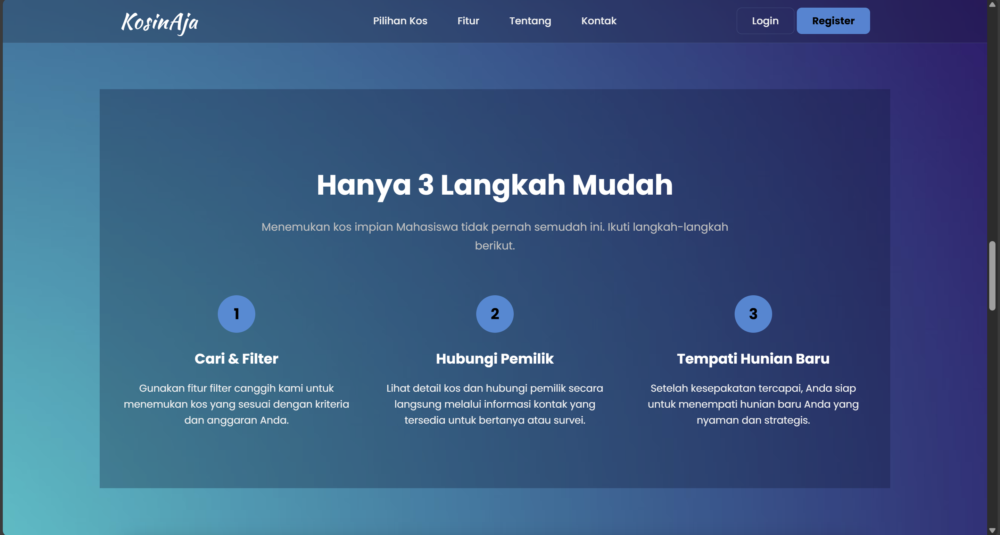

# KosinAja - Boarding House Finder

A modern web platform designed to help students of Politeknik Statistika STIS find their ideal boarding house (Kos). This project also provides an intuitive dashboard for property owners to manage their listings.





## About The Project

Finding a suitable place to live is a common challenge for students. KosinAja aims to solve this by creating a centralized, user-friendly, and secure platform connecting students with property owners around the STIS campus. The project focuses on providing a seamless experience for both user roles: the student searching for a room and the owner listing a property.

---

## ✨ Key Features

The platform's functionality is divided based on two primary user roles:

### For Seekers (Students)
- **Advanced Search:** Users can filter listings by name, location, and key facilities (e.g., Air Conditioning, Wi-Fi, Private Bathroom).
- **Live Search Suggestions:** Get real-time suggestions for property names and locations as you type.
- **Detailed Listings:** Each property has a dedicated page with a full description, photo gallery, facility list, price, and owner's contact information.
- **Responsive Design:** A fully responsive layout built with modern CSS ensures a great experience on any device, from mobile phones to desktops.
- **User Accounts:** Users can register and log in to manage their profiles.

### For Property Owners
- **Management Dashboard:** A dedicated dashboard to view and manage all registered properties in one place.
- **Property Management (CRUD):** Owners have full Create, Read, Update, and Delete capabilities for their listings.
- **Secure Access Control:** An owner can only modify or delete the properties they personally own, ensuring data integrity.
- **Targeted Marketing:** A direct channel to market properties to a specific and relevant audience.

---

## 🛠️ Tech Stack

This project is built with a focus on efficiency, security, and modern web standards.

- **Frontend:**
  - `HTML5`
  - `CSS3` (Flexbox, Grid, Glassmorphism Effect)
  - `Vanilla JavaScript` (DOM Manipulation, Fetch API for Live Search, Intersection Observer for scroll animations)

- **Backend:**
  - `PHP` (Handles all server-side logic, session management, and database operations)

- **Database:**
  - `MySQL`
  - `PDO` (PHP Data Objects) is used for secure database connections and to prevent SQL injection attacks.

---

## 🚀 Getting Started

To get a local copy up and running, follow these simple steps.

### Prerequisites

- A local web server environment like [XAMPP](https://www.apachefriends.org/index.html) or MAMP.
- A web browser (e.g., Chrome, Firefox).
- [Git](https://git-scm.com/) (optional, for cloning).

### Installation

1.  **Clone the repository**
    ```bash
    git clone [https://github.com/YOUR_USERNAME/YOUR_REPOSITORY.git](https://github.com/YOUR_USERNAME/YOUR_REPOSITORY.git)
    ```
    Alternatively, you can download the project as a ZIP file and extract it.

2.  **Move to Web Server Directory**
    - Place the project folder inside the `htdocs` directory of your XAMPP installation.

3.  **Database Setup**
    - Start the Apache and MySQL modules from the XAMPP Control Panel.
    - Open your browser and navigate to `http://localhost/phpmyadmin`.
    - Create a new database named `kosinaja`.
    - Select the `kosinaja` database and go to the **Import** tab.
    - Upload the `.sql` file that contains the table structure and initial data. *(Note: You will need to export your current database to a `.sql` file first)*.

4.  **Configure Connection**
    - Open the `php/connect.php` file.
    - Adjust the database credentials if they differ from the default XAMPP setup.
    ```php
    <?php
    $host = 'localhost';
    $db_name = 'kosinaja';
    $username = 'root'; 
    $password = ''; // Change this if your MySQL root user has a password
    
    // ... rest of the code
    ?>
    ```

5.  **Run the Project**
    - Open your browser and go to `http://localhost/your-project-folder-name` (e.g., `http://localhost/KosinAja`).
    - The website is now live on your local machine!

---

## 📄 License

This project is licensed under the MIT License - see the [LICENSE.md](LICENSE.md) file for details.

---

Created by Xavier Yubin Raditio
